<h1 align="center"> <p> Rail3D </p></h1>
<h3 align="center">
<a href="" target="_blank">Rail3D: Multi-Context Point Cloud Dataset and New Approach for Railways Semantic Understanding</a>
</h3>

In this paper, we propose the first multi-context point cloud dataset called Rail3D. This dataset covers three countries: Hungary, France, and Belgium, with a total length of almost 5.8 kilometers and approximately 288 million points. It covers the 9 most relevant classes for railway applications: Ground, Vegetation, Rail, Poles, Wires, Signalling, Fences, Installations, and Buildings. We conducted a generic classification with 9 universal classes (Ground, Vegetation, Rail, Poles, Wires, Signaling, Fence, Installation and Building) and evaluated the performance of three state-of-the-art models: KPConv (Kernel Point Convolution), LightGBM, and Random Forest. The best performing model, a fine-tuned KPConv, achieved a mean Intersection over Union (mIoU) of 86%. While the LightGBM-based method achieved a mIoU of 71%, outperforming Random Forest. We are also looking for feedback from the user community to improve our approach and grow the dataset with other countries. We recommend evaluating our developed dataset with alternative deep learning methods to assess their performance. Additionally, exploring the developed method in diverse railway contexts by selecting different objects. Future work involves the exploration of semantic information within the Rail3D for 3D change detection, aiming to assess the use of semantics for change detection in different railway contexts.

# ⭐ Download

Please fill out this [**Data Request**](https://forms.gle/2iLWQQhhyRfzGrgq5) if you have access to Google Forms. 

Download links will be sent automatically after completing the application.


# 📌 Dataset

This section details the process of creating the datasets and the methods developed. We begin by describing the data specifications, then the used classes, and how the annotation process was performed.


## Dataset specification
The Rail3D dataset is the first multi-context point cloud dataset for railway semantic understanding. It is composed of three distinct datasets from Hungary, France, and Belgium, providing a diverse representation of the railway. We annotated three datasets for rail-way scene understanding: HMLS, SNCF, and INFRABEL. The first two datasets are publicly available and provide a diverse representation of railway environments. The third dataset was provided by Infrabel, the Belgian railway infrastructure manager, under a confidentiality agreement. The datasets were acquired using different LiDAR sensors, en-suring a wide range of point densities and acquisition conditions. This diversity is crucial for developing robust and generalizable models for railway scene understanding. The specifications of each dataset are detailed in the subsections below.

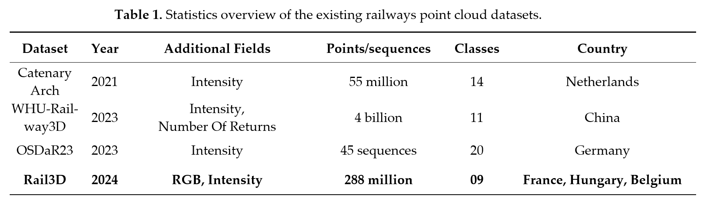

### Hungarian MLS point clouds of railroad environment
This LiDAR dataset represents a collection acquired by the Hungarian State Railways using the mobile mapping system (MMS); Riegl VMX-450 high-density. These LiDAR scans were conducted from a railroad vehicle recording data at a rate of 1.1 million points per second. It exhibited high precision, with an average 3D range accuracy of 3 mm and a maximum threshold of 7 mm, ensuring high-quality data capture. The positional accuracy of the acquired point clouds averaged 3 cm, with a maximum threshold of 5 cm. This dataset not only contain georeferenced spatial information in the form of 3D coordinates but also incorporate intensity and RGB data, enhancing their utility for diverse applica-tions. The datasets adhere to the Hungarian national spatial reference system, designated as EPSG:23700, ensuring their compatibility with regional mapping efforts. Originally, three distinct datasets were thoughtfully selected, each representing different topograph-ical regions within Hungary. The original data can be found at: https://data.mendeley.com/datasets/ccxpzhx9dj/ under CC BY NC 3.0 licence.
  
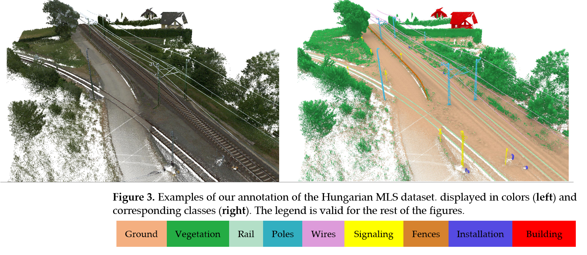

### French MLS point clouds of railroad environment
The SNCF LiDAR dataset is a valuable resource provided by SNCF Reseau, the French state-owned railway company. This dataset comprises approximately 2 kilometers of rail-borne LiDAR data, representing a non-annotated subset of a more extensive collection. The geospatial reference system employed for this dataset is RGF93-CC44 / NGF-IGN69, ensuring its alignment with regional mapping standards and geographic referencing. The dataset is primarily presented in the compressed LAZ format with a total of 16 tiles publicly available under the Open Database License (ODbL).
The original data can be found at:https://ressources.data.sncf.com/explore/dataset/nuage-points-3d/table/

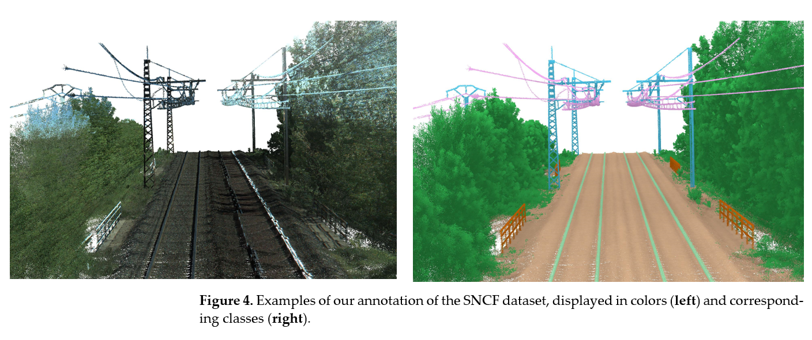 

### Belgian MLS point clouds of railroad environment
For several years, Infrabel, the Belgian railway infrastructure manager, was using LiDAR technology to acquire data about the country's railway network. The lidar acquisition process involves mounting a Z+F 9012 lidar sensor on the front part of a train (EM202 vehicle) and recording the point cloud data as the train travels along the tracks. The train collects data for every railway line in Belgium at least twice a year. This is highly relevant for 3D detection of change studies, which we will be looking at in our next studies. In ad-dition to LiDAR, 4 cameras are used to capture the colours, 2 at the front and 2 at the back. However, for this application, we only used the point cloud with intensity, and without colours. The point clouds are encoded in LAS format and the coordinates are in Lambert Belge 72. We have chosen three different areas in Belgium; Brussels, mid-way Brussels and Ghent, and the south of Ghent. Each of these contexts presented a different challenge, either in terms of occlusion, complexity, or unbalanced classes.

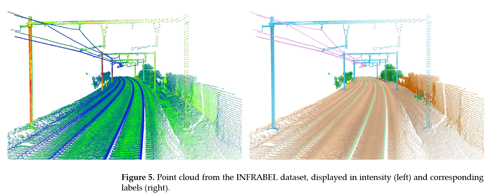

### Update: New Dutch MLS point clouds of railroad environment

We recently added a large dataset on the Dutch railways. The data was annotated by Milo Beliën as part of his master's thesis on point cloud segmentation, and some of it was annotated and edited by us. The point clouds in .ply format are in the EPSG:28992 coordinate system, and cover two main areas: 

1. Single lane track section between the Dutch cities Venendaal - Renen
2. Dual lane track section near the Dutch city of Culemborg.

The raw data was downloaded from https://spoorinbeeld.nl/, and is licensed under https://www.spoordata.nl/disclaimer?
To download the annotated data, click on the link: [**Data Request**](https://forms.gle/2iLWQQhhyRfzGrgq5)

Note that a new class (number 10) was added to cover all dynamic objects (human, train) and the rest of the unidentified objects.

For further information, please contact: 2002milo@gmail.com or akharroubi@uliege.be

## Classes typology
To ensure the comprehensiveness and relevance of the class labels, we conducted a thorough review of existing literature and consulted with railway industry experts. Therefore, we have not limited our analysis to the meaning and geometric appearance of each class, but also its relevance to the railway industry. This resulted in the following list of classes and their corresponding objects as illustrated in Figure 5:
- Ground (label 1): Represents various ground surfaces, including rough ground, cement, and asphalt.
- Vegetation (label 2): Covers all types of vegetation present in the railway environment, such as trees, and median vegetation.
- Rail (label 3): Refers to the physical track structure; rails.
- Poles (label 4): Includes all types of poles found along the railway, such as catenary poles, and utility poles.
- Wires (label 5): Covers various overhead wires, including catenary wires, power lines, and communication cables.
- Signalling (label 6): Represents all types of railway signaling equipment, such as traffic lights, and traffic signs.
- Fence (label 7): Includes various types of fences and barriers used along the railway, such as security fences, noise insulation panels, and guardrails.
- Installation (label 8): Refers to larger structures that are part of the railway infrastructure, such as boxes, and passenger cabins.
- Building (label 9): Covers all types of buildings located within the railway corridor, such as houses, warehouses, and stations.

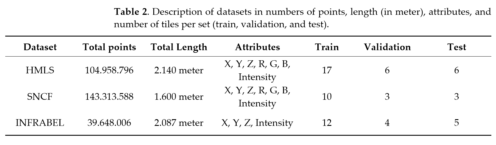


# ⭐ Benchmark

These experiments required the creation of python code and the implementation of the original experiments. For 3DMASC, from feature extraction to inference, it was performed with 3DMAsc plugin of cloudcompare. Whereas for KPConv, we utilize PyTorch original implementations. For LightGBM and 3DMasc we used Cloud-Compare Plugin for feature extraction and feature importance. Then, we created Py-thon scripts with LightGBM framework (version 4.3.0) for classification. All these codes were accessed on 14 January 2024 and experiments were carried out on a workstation with a NVIDIA GeForce RTX 3090 graphics card and an i9-10980XE CPU @ 3.00GHz with 256 GB RAM. 


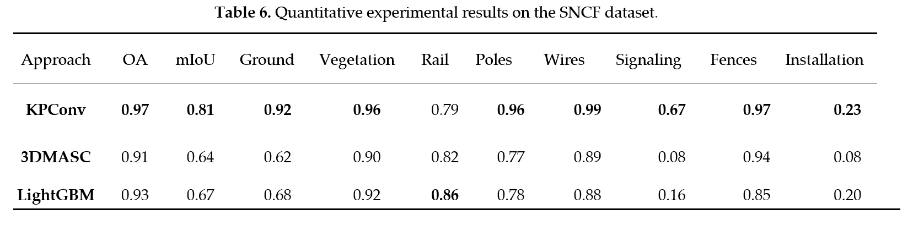

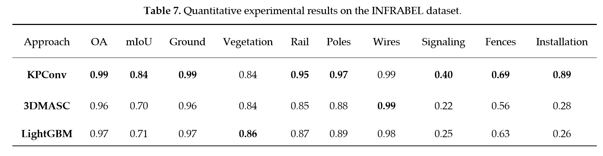 

In the following figure we visually show samples of the point cloud, ground truth inputs and the results of KPConv, 3DMasc and LightGBM successively.

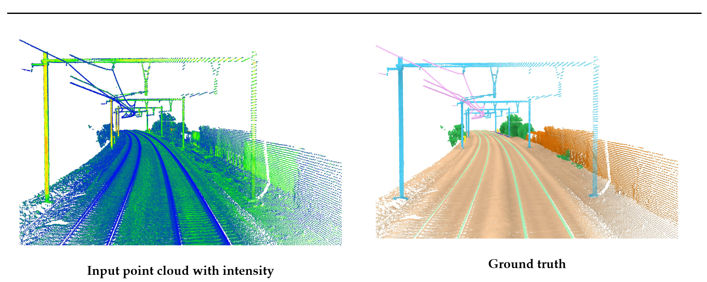

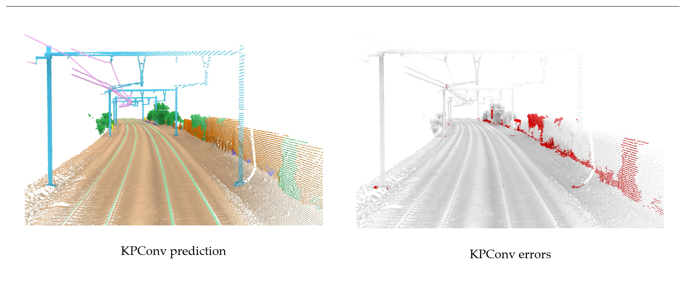

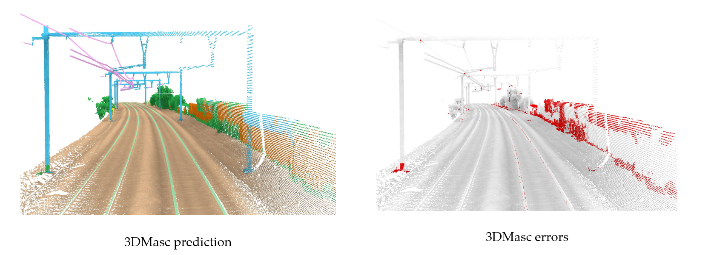

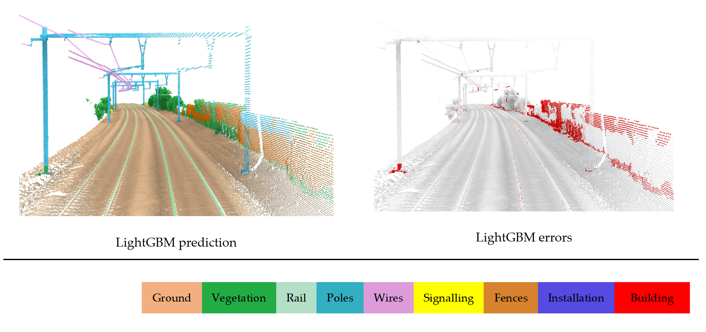


# ✔ Implementation

## KPConv implementation
This section contains the the machine learning model developed for semantic segmentation of railway environments using KPConv.
## Introduction
This repository details the implementation of Kernel Point Convolution (KPConv) in PyTorch for the Rail3D dataset. KPConv is a powerful point convolution operator for point clouds, introduced in the ICCV2019 paper by Hugues Thomas et al. For more details, visit the [KPConv-PyTorch GitHub repository](https://github.com/HuguesTHOMAS/KPConv-PyTorch).

If you find KPConv useful in your research, please consider citing the original paper:

```
@article{thomas2019KPConv,
Author = {Thomas, Hugues and Qi, Charles R. and Deschaud, Jean-Emmanuel and Marcotegui, Beatriz and Goulette, Fran{\c{c}}ois and Guibas, Leonidas J.},
Title = {KPConv: Flexible and Deformable Convolution for Point Clouds},
Journal = {Proceedings of the IEEE International Conference on Computer Vision},
Year = {2019}
}
```


## Data Preparation
1. **Data Location**: Assume the experiment folder is located at `XXXX/Experiments/KPConv-PyTorch`. The Rail3D dataset should be placed in a common Data folder at `XXXX/Data`. Thus, the relative path to the Data folder is `../../Data`.

2. **Dataset Setup**: Modify the `self.path` variable in the dataset class to point to your Rail3D dataset location.

## Training KPConv on Rail3D
To train KPConv on the Rail3D dataset, follow these steps:

1. **Start Training**:
    - Run the training script tailored for the Rail3D dataset. If you're adapting an existing script, ensure the dataset paths and configurations are correctly set for Rail3D.
    ```bash
    python training_Rail3D.py
    ```
    - The first run might take some time as it may precompute certain dataset structures.

2. **Training Configuration**:
    - Adjustments to the training parameters can be made in a configuration subclass. Ensure to review and modify these settings to optimize training for Rail3D.

## Monitoring Training Progress
- **Log Folder**: Each training session creates a dated log folder containing loss values, validation metrics, model checkpoints, etc.
- **Plotting Convergence**: Use the `plot_convergence.py` script to visualize training progress. Detailed instructions within the script will guide you in selecting the appropriate training log.
    ```bash
    python plot_convergence.py
    ```

## Testing the Trained Model
To test a trained KPConv model on the Rail3D dataset:

1. **Selecting the Model**: In `test_model.py`, follow the commented instructions to select the trained model you wish to test.
2. **Running the Test**:

    ```bash
    python test_model.py
    ```

This guide provides a comprehensive overview of applying KPConv to the Rail3D dataset, from data preparation through training to testing the model. For further customization and advanced usage, refer to the [KPConv-PyTorch documentation](https://github.com/HuguesTHOMAS/KPConv-PyTorch).


## 3DMasc implementation
This section contains the the machine learning model developed for semantic segmentation of railway environments using the 3DMASC plugin in CloudCompare.


### Prerequisites
- CloudCompare (latest version with 3DMASC plugin included)


### Installation
1. **CloudCompare**: Download and install CloudCompare from the [official website](https://www.danielgm.net/cc/). Ensure you have the latest version that includes the 3DMASC plugin.
2. **Rail3D Dataset and Configuration Files**: Download the Rail3D dataset and the necessary configuration files for segmentation.


### Step 1: Load the Dataset in CloudCompare
- Open CloudCompare.
- Navigate to `File` > `Open` and select the Rail3D dataset file from the cloned repository.

### Step 2: Semantic Segmentation with 3DMASC
#### Access 3DMASC Plugin
- In CloudCompare, go to `Plugins` > `3DMASC`.

#### Train a New Classifier
- Select "Train classifier".
- Specify the core points cloud (PCX) and the parameter file from this repository.
- Adjust settings as necessary and start the training. Save the model upon completion.

#### Apply a Pre-trained Classifier
- Choose "3DMASC classification".
- Provide the path to your pre-trained classifier model and the parameter file.
- Execute the classification. The dataset will be updated with segmentation results.

### Step 3: Exporting the Segmented Dataset
- After segmentation, export the results via `File` > `Save As`.
- Choose your preferred format and specify the destination.

```
@article{letard2024,
title={3DMASC: Accessible, explainable 3D point clouds classification. Application to bi-spectral topo-bathymetric lidar data},
author={Letard, Mathilde and Lague, Dimitri and Le Guennec, Arthur and Lefèvre, Sébastien and Feldmann, Baptiste and Leroy, Paul and Girardeau-Montaut, Daniel and Corpetti, Thomas},
journal={ISPRS Journal of Photogrammetry and Remote Sensing},
year={2024},
}
```

## ✨ Citation

If you find our work useful in your research, please consider citing:

```
@article{
Kharroubi, A.; Ballouch, Z.; Hajji, R.; Yarroudh, A.; Billen, R. 
Multi-Context Point Cloud Dataset and Machine Learning for Railway Semantic Segmentation. 
Infrastructures 2024, 9, 71. https://doi.org/10.3390/infrastructures9040071
}
```
## 🙌 Acknowledgements

This study is part of the first author’s Ph.D. thesis. We thank the dataset providers. The original data used in this study are publicly available at: https://ressources.data.sncf.com/explore/dataset/nuage-points-3d for French data, and at https://data.mendeley.com/datasets/ccxpzhx9dj for Hungarian data (accessed on 28 November 2023).

## 🤝 Related Work

1. [KPconv: Flexible and Deformable Convolution for Point Clouds](https://github.com/HuguesTHOMAS/KPConv)


